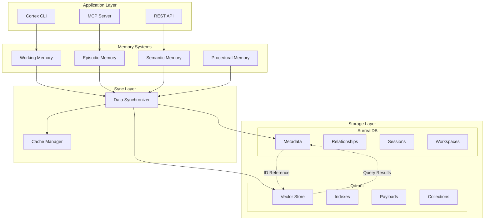

# Cortex Vector Search Migration: From In-Memory HNSW to Qdrant

## Executive Summary

This specification outlines the migration strategy for transitioning Cortex's semantic search capabilities from the current in-memory HNSW implementation to Qdrant vector database, while maintaining seamless integration with SurrealDB for structured data storage.

---

## 1. Current Architecture Analysis

### 1.1 Cortex-Semantic Module

**Current Implementation:**
- **Vector Index:** Custom HNSW implementation using `instant-distance` crate
- **Storage:** In-memory with optional file persistence (bincode serialization)
- **Caching:** Two-tier caching (embedding cache + query cache)
- **Providers:** OpenAI, ONNX Runtime, Ollama, Mock
- **Search:** Hybrid search with keyword + semantic components

**Key Components:**
```
cortex-semantic/
├── providers.rs    # Embedding providers (OpenAI, ONNX, Ollama)
├── index.rs        # HNSW index implementation
├── search.rs       # Main search engine
├── query.rs        # Query processing and expansion
├── ranking.rs      # Result ranking and scoring
├── cache.rs        # Embedding and query caching
└── types.rs        # Core data structures
```

**Strengths:**
- Modular design with clear separation of concerns
- Comprehensive caching strategy
- Support for multiple embedding providers
- Hybrid search capabilities

**Limitations:**
- **Memory Constraints:** All vectors must fit in RAM
- **Single-Node:** No distributed search capability
- **Persistence:** Basic file serialization, no ACID guarantees
- **Scalability:** Limited to ~1M vectors efficiently
- **No Filtering During Search:** Post-search filtering reduces efficiency
- **Manual Index Management:** Requires explicit save/load operations

### 1.2 Cortex-Storage Module

**Current Role:**
- Primary data storage using SurrealDB
- Connection pooling with circuit breaker
- Transaction management
- Session-aware storage for multi-agent coordination

**Key Features:**
- Production-ready connection pool
- Health monitoring and retry policies
- ACID transactions
- Schema management

### 1.3 Cortex-Memory Module

**Memory Hierarchy:**
1. **Working Memory:** Fast, temporary (7±2 items limit)
2. **Episodic Memory:** Development sessions with context
3. **Semantic Memory:** Code structures and patterns
4. **Procedural Memory:** Learned workflows
5. **Memory Consolidation:** Cross-tier optimization

**Current Integration:**
- Uses cortex-semantic for similarity search
- Stores metadata in SurrealDB
- Hybrid approach: vectors in memory, data in database

---

## 2. Qdrant Integration Strategy

### 2.1 Why Qdrant?

**Advantages over Current Implementation:**

1. **Scalability**
   - Horizontal scaling via sharding and replication
   - Can handle billions of vectors
   - Distributed deployment options

2. **Performance**
   - Hardware acceleration (SIMD)
   - Async I/O with io_uring
   - Vector quantization reduces RAM by 97%
   - Query planning with payload indexes

3. **Advanced Features**
   - Native filtering during search (not post-search)
   - Hybrid search with sparse vectors
   - Geo-spatial search
   - Full-text search integration
   - Dynamic collection updates

4. **Production Features**
   - Write-ahead logging for durability
   - Zero-downtime rolling updates
   - Built-in monitoring and metrics
   - Cloud-managed option available

### 2.2 Architecture Design



### 2.3 Data Flow and Synchronization

**Unified ID System:**
```rust
// Core identifier used across both systems
pub struct CortexEntityId {
    pub uuid: Uuid,
    pub entity_type: EntityType,
    pub version: u64,
}
```

**Data Distribution:**

| Data Type | SurrealDB | Qdrant | Notes |
|-----------|-----------|---------|-------|
| Entity Metadata | ✅ Primary | ✅ Cached | Full metadata in Surreal, subset in Qdrant payloads |
| Relationships | ✅ Exclusive | ❌ | Graph queries via Surreal |
| Embeddings | ❌ | ✅ Exclusive | All vectors in Qdrant |
| Session State | ✅ Exclusive | ❌ | Transaction consistency |
| Search Indexes | ❌ | ✅ Exclusive | HNSW, filters in Qdrant |
| Audit Logs | ✅ Exclusive | ❌ | Compliance in Surreal |

---

## 3. Implementation Plan

### Phase 1: Foundation (Week 1-2)

#### 1.1 Create Qdrant Client Module
```rust
// cortex-qdrant/src/lib.rs
pub struct QdrantClient {
    client: qdrant_client::QdrantClient,
    collections: HashMap<String, CollectionConfig>,
    metrics: Arc<Metrics>,
}

impl QdrantClient {
    pub async fn new(config: QdrantConfig) -> Result<Self>;
    pub async fn create_collection(&self, name: &str, config: CollectionConfig) -> Result<()>;
    pub async fn upsert_points(&self, collection: &str, points: Vec<Point>) -> Result<()>;
    pub async fn search(&self, request: SearchRequest) -> Result<Vec<ScoredPoint>>;
    pub async fn delete_points(&self, collection: &str, ids: Vec<PointId>) -> Result<()>;
}
```

#### 1.2 Define Collection Schema
```yaml
collections:
  # Code embeddings
  code_vectors:
    vector_size: 1536  # OpenAI ada-002
    distance: Cosine
    payload_schema:
      entity_id: keyword
      entity_type: keyword
      workspace_id: keyword
      language: keyword
      file_path: keyword
      created_at: datetime
      updated_at: datetime

  # Documentation embeddings
  doc_vectors:
    vector_size: 768  # Sentence transformers
    distance: Cosine
    payload_schema:
      entity_id: keyword
      doc_type: keyword
      workspace_id: keyword
      language: keyword

  # Memory consolidation vectors
  memory_vectors:
    vector_size: 1536
    distance: Cosine
    payload_schema:
      memory_type: keyword  # episodic, semantic, procedural
      agent_id: keyword
      workspace_id: keyword
      importance: float
      recency: datetime
```

### Phase 2: Adapter Layer (Week 2-3)

#### 2.1 Create VectorStore Trait
```rust
// cortex-core/src/vector_store.rs
#[async_trait]
pub trait VectorStore: Send + Sync {
    async fn insert(&self, id: EntityId, vector: Vector, metadata: Metadata) -> Result<()>;
    async fn insert_batch(&self, items: Vec<(EntityId, Vector, Metadata)>) -> Result<()>;
    async fn search(&self, query: SearchQuery) -> Result<Vec<SearchResult>>;
    async fn update(&self, id: EntityId, vector: Option<Vector>, metadata: Option<Metadata>) -> Result<()>;
    async fn delete(&self, id: EntityId) -> Result<()>;
    async fn get(&self, id: EntityId) -> Result<Option<(Vector, Metadata)>>;
}

// Implementations
pub struct QdrantVectorStore { ... }
pub struct InMemoryVectorStore { ... }  // Current HNSW
pub struct HybridVectorStore { ... }    // Migration helper
```

#### 2.2 Implement Synchronization Manager
```rust
// cortex-storage/src/sync_manager.rs
pub struct DataSyncManager {
    surreal: Arc<SurrealStorage>,
    qdrant: Arc<QdrantClient>,
    cache: Arc<CacheManager>,
    consistency_checker: ConsistencyChecker,
}

impl DataSyncManager {
    /// Ensures data consistency between SurrealDB and Qdrant
    pub async fn sync_entity(&self, entity: Entity) -> Result<()> {
        // 1. Write metadata to SurrealDB
        let tx = self.surreal.begin_transaction().await?;
        tx.upsert_entity(&entity.metadata).await?;

        // 2. Write vector to Qdrant
        self.qdrant.upsert_point(
            entity.collection,
            entity.id,
            entity.vector,
            entity.payload,
        ).await?;

        // 3. Commit transaction
        tx.commit().await?;

        // 4. Update cache
        self.cache.invalidate(&entity.id).await;

        Ok(())
    }

    /// Handles failures and ensures eventual consistency
    pub async fn handle_partial_failure(&self, operation: FailedOperation) -> Result<()>;
}
```

### Phase 3: Migration Implementation (Week 3-4)

#### 3.1 Dual-Write Strategy
```rust
// During migration: write to both systems
pub struct MigrationAdapter {
    old_store: Arc<InMemoryVectorStore>,
    new_store: Arc<QdrantVectorStore>,
    mode: MigrationMode,
}

pub enum MigrationMode {
    OldOnly,        // Phase 0: Current state
    DualWrite,      // Phase 1: Write both, read old
    DualVerify,     // Phase 2: Write both, read both, compare
    NewPrimary,     // Phase 3: Write both, read new
    NewOnly,        // Phase 4: Migration complete
}
```

#### 3.2 Batch Migration Tool
```rust
// cortex-cli/src/commands/migrate.rs
pub async fn migrate_vectors(
    source: &dyn VectorStore,
    target: &dyn VectorStore,
    options: MigrationOptions,
) -> Result<MigrationReport> {
    let total = source.count().await?;
    let mut migrated = 0;

    // Stream vectors in batches
    let mut cursor = None;
    while let Some(batch) = source.next_batch(cursor, options.batch_size).await? {
        // Validate vectors
        for (id, vector, metadata) in &batch {
            validate_vector(vector, options.dimension)?;
        }

        // Insert into target
        target.insert_batch(batch).await?;

        migrated += batch.len();
        progress.update(migrated, total);

        cursor = batch.last().map(|(id, _, _)| id.clone());
    }

    Ok(MigrationReport { total, migrated, ... })
}
```

### Phase 4: Integration Updates (Week 4-5)

#### 4.1 Update SemanticSearchEngine
```rust
// cortex-semantic/src/search.rs
pub struct SemanticSearchEngine {
    vector_store: Arc<dyn VectorStore>,  // Now pluggable
    provider: Arc<ProviderManager>,
    query_processor: QueryProcessor,
    ranker: Ranker,
    cache: Arc<CacheManager>,
}

impl SemanticSearchEngine {
    pub async fn new_with_qdrant(config: SemanticConfig) -> Result<Self> {
        let qdrant = QdrantVectorStore::new(config.qdrant).await?;
        Self::new_with_store(Arc::new(qdrant), config).await
    }
}
```

#### 4.2 Update CognitiveManager
```rust
// cortex-memory/src/cognitive.rs
impl CognitiveManager {
    pub async fn search_memories(
        &self,
        query: &str,
        memory_types: Vec<MemoryType>,
        filters: SearchFilters,
    ) -> Result<Vec<Memory>> {
        // 1. Search vectors in Qdrant
        let vector_results = self.vector_store.search(
            SearchQuery {
                vector: self.embed(query).await?,
                filters: self.build_qdrant_filters(&filters),
                limit: filters.limit,
            }
        ).await?;

        // 2. Fetch metadata from SurrealDB
        let ids: Vec<_> = vector_results.iter().map(|r| &r.id).collect();
        let metadata = self.surreal.fetch_batch(&ids).await?;

        // 3. Combine and rank
        self.combine_results(vector_results, metadata).await
    }
}
```

### Phase 5: Testing and Validation (Week 5-6)

#### 5.1 Consistency Tests
```rust
#[cfg(test)]
mod consistency_tests {
    #[tokio::test]
    async fn test_surreal_qdrant_consistency() {
        // Insert entity
        let entity = create_test_entity();
        sync_manager.sync_entity(entity).await.unwrap();

        // Verify in both systems
        let surreal_data = surreal.get(&entity.id).await.unwrap();
        let qdrant_data = qdrant.get(&entity.id).await.unwrap();

        assert_eq!(surreal_data.id, qdrant_data.payload["entity_id"]);
        assert_eq!(surreal_data.metadata, qdrant_data.payload["metadata"]);
    }
}
```

#### 5.2 Performance Benchmarks
```rust
#[bench]
fn bench_search_performance(b: &mut Bencher) {
    // Compare old vs new implementation
    let runtime = tokio::runtime::Runtime::new().unwrap();

    b.iter(|| {
        runtime.block_on(async {
            let results = engine.search("test query", 100).await.unwrap();
            black_box(results);
        });
    });
}
```

### Phase 6: Production Rollout (Week 6-7)

#### 6.1 Feature Flags
```rust
pub struct FeatureFlags {
    pub use_qdrant: bool,
    pub dual_write: bool,
    pub shadow_mode: bool,  // Run both, compare results
}
```

#### 6.2 Monitoring
```rust
pub struct VectorStoreMetrics {
    pub insert_latency: Histogram,
    pub search_latency: Histogram,
    pub error_rate: Counter,
    pub consistency_mismatches: Counter,
}
```

---

## 4. Configuration Updates

### 4.1 Global Configuration
```toml
# ~/.ryht/cortex/config.toml

[vector_store]
provider = "qdrant"  # or "memory" for legacy
migration_mode = "dual_verify"

[qdrant]
url = "http://localhost:6333"
api_key = ""  # Optional
timeout_ms = 30000
grpc_port = 6334

[qdrant.collections.code]
name = "code_vectors"
vector_size = 1536
distance = "Cosine"
replication_factor = 2
shard_number = 4

[qdrant.collections.memory]
name = "memory_vectors"
vector_size = 1536
distance = "Cosine"
on_disk = true  # For large collections
```

### 4.2 Environment Variables
```bash
CORTEX_VECTOR_STORE=qdrant
QDRANT_URL=http://localhost:6333
QDRANT_API_KEY=${QDRANT_API_KEY}
QDRANT_COLLECTION_PREFIX=cortex_
```

---

## 5. Data Integrity and Consistency

### 5.1 Transaction Patterns

**Pattern 1: Coordinated Writes**
```rust
async fn coordinated_write(entity: Entity) -> Result<()> {
    // 1. Begin SurrealDB transaction
    let tx = surreal.begin().await?;

    // 2. Write metadata
    tx.create(&entity.metadata).await?;

    // 3. Write to Qdrant (idempotent)
    qdrant.upsert(entity.id, entity.vector).await?;

    // 4. Commit if Qdrant succeeded
    tx.commit().await?;

    Ok(())
}
```

**Pattern 2: Compensating Transactions**
```rust
async fn compensating_delete(id: EntityId) -> Result<()> {
    // Track operations for rollback
    let mut rollback = RollbackLog::new();

    // 1. Soft delete in SurrealDB
    surreal.soft_delete(&id).await?;
    rollback.add(|| surreal.restore(&id));

    // 2. Delete from Qdrant
    match qdrant.delete(&id).await {
        Ok(_) => {
            // 3. Hard delete from SurrealDB
            surreal.hard_delete(&id).await?;
        }
        Err(e) => {
            // Rollback soft delete
            rollback.execute().await?;
            return Err(e);
        }
    }

    Ok(())
}
```

### 5.2 Consistency Verification

```rust
pub struct ConsistencyChecker {
    surreal: Arc<SurrealStorage>,
    qdrant: Arc<QdrantClient>,
}

impl ConsistencyChecker {
    pub async fn verify_entity(&self, id: &EntityId) -> ConsistencyStatus {
        let surreal_exists = self.surreal.exists(id).await.unwrap_or(false);
        let qdrant_exists = self.qdrant.exists(id).await.unwrap_or(false);

        match (surreal_exists, qdrant_exists) {
            (true, true) => ConsistencyStatus::Consistent,
            (true, false) => ConsistencyStatus::MissingVector,
            (false, true) => ConsistencyStatus::OrphanVector,
            (false, false) => ConsistencyStatus::NotFound,
        }
    }

    pub async fn repair(&self, id: &EntityId, status: ConsistencyStatus) -> Result<()> {
        match status {
            ConsistencyStatus::MissingVector => {
                // Re-generate and insert vector
                let metadata = self.surreal.get(id).await?;
                let vector = generate_embedding(&metadata.content).await?;
                self.qdrant.upsert(id, vector).await?;
            }
            ConsistencyStatus::OrphanVector => {
                // Remove orphaned vector
                self.qdrant.delete(id).await?;
            }
            _ => {}
        }
        Ok(())
    }
}
```

---

## 6. Performance Optimization

### 6.1 Caching Strategy

```rust
pub struct HybridCache {
    // L1: In-process cache for hot data
    local: Arc<DashMap<CacheKey, CachedResult>>,

    // L2: Redis for shared cache
    redis: Arc<RedisClient>,

    // L3: Qdrant payload cache
    qdrant_cache: bool,
}

impl HybridCache {
    pub async fn get(&self, key: &CacheKey) -> Option<CachedResult> {
        // Try L1
        if let Some(result) = self.local.get(key) {
            return Some(result.clone());
        }

        // Try L2
        if let Ok(Some(result)) = self.redis.get(key).await {
            self.local.insert(key.clone(), result.clone());
            return Some(result);
        }

        None
    }
}
```

### 6.2 Query Optimization

```rust
pub struct OptimizedSearcher {
    qdrant: Arc<QdrantClient>,
    surreal: Arc<SurrealStorage>,
}

impl OptimizedSearcher {
    pub async fn hybrid_search(&self, query: Query) -> Result<Vec<SearchResult>> {
        // Parallel execution
        let (vector_results, keyword_results) = tokio::join!(
            self.vector_search(&query),
            self.keyword_search(&query)
        );

        // Merge and re-rank
        let merged = self.merge_results(
            vector_results?,
            keyword_results?,
            query.ranking_weights
        );

        // Batch fetch metadata
        let ids: Vec<_> = merged.iter().map(|r| &r.id).collect();
        let metadata = self.surreal.batch_get(&ids).await?;

        Ok(self.combine(merged, metadata))
    }
}
```

---

## 7. Risk Mitigation

### 7.1 Identified Risks

| Risk | Impact | Probability | Mitigation |
|------|--------|-------------|------------|
| Data Loss During Migration | High | Low | Dual-write, backups, validation |
| Performance Degradation | Medium | Medium | Shadow mode, gradual rollout |
| Qdrant Downtime | High | Low | Fallback to in-memory, circuit breaker |
| Consistency Issues | High | Medium | Verification jobs, repair tools |
| Increased Complexity | Medium | High | Good abstractions, documentation |

### 7.2 Rollback Plan

```rust
pub struct RollbackManager {
    checkpoints: Vec<MigrationCheckpoint>,
    backup_store: Arc<dyn VectorStore>,
}

impl RollbackManager {
    pub async fn create_checkpoint(&mut self) -> Result<CheckpointId> {
        let checkpoint = MigrationCheckpoint {
            timestamp: Utc::now(),
            mode: self.current_mode(),
            statistics: self.gather_stats().await?,
        };

        self.checkpoints.push(checkpoint.clone());
        self.backup_store.save_checkpoint(&checkpoint).await?;

        Ok(checkpoint.id)
    }

    pub async fn rollback_to(&self, checkpoint_id: CheckpointId) -> Result<()> {
        // 1. Find checkpoint
        let checkpoint = self.find_checkpoint(checkpoint_id)?;

        // 2. Restore configuration
        self.restore_config(&checkpoint.config).await?;

        // 3. Switch traffic back
        self.switch_mode(checkpoint.mode).await?;

        // 4. Verify health
        self.verify_system_health().await?;

        Ok(())
    }
}
```

---

## 8. Success Metrics

### 8.1 Performance Targets

| Metric | Current (HNSW) | Target (Qdrant) | Measurement |
|--------|----------------|-----------------|-------------|
| Search Latency (p50) | 25ms | 15ms | Prometheus histogram |
| Search Latency (p99) | 100ms | 50ms | Prometheus histogram |
| Index Update Time | 5ms | 3ms | Application metrics |
| Memory Usage | 8GB (1M vectors) | 2GB | System metrics |
| Max Vectors | 1M | 100M+ | Load testing |
| Concurrent Searches | 100/s | 1000/s | Load testing |

### 8.2 Quality Metrics

```rust
pub struct QualityMetrics {
    pub search_relevance: f64,      // A/B testing score
    pub consistency_rate: f64,       // % of consistent entities
    pub availability: f64,           // Uptime percentage
    pub data_freshness: Duration,    // Max staleness
}
```

---

## 9. Future Enhancements

### 9.1 Advanced Qdrant Features
- **Multi-tenancy:** Separate collections per workspace
- **Sparse Vectors:** Enhanced keyword search
- **Quantization:** Reduce memory usage further
- **Geo-search:** Location-based code search
- **Snapshotting:** Point-in-time recovery

### 9.2 System Improvements
- **GraphQL API:** Unified query interface
- **Event Sourcing:** Track all vector changes
- **ML Pipeline:** Automatic retraining of embeddings
- **Federated Search:** Query across multiple Qdrant clusters

---

## 10. Implementation Checklist

### Phase 1: Foundation ⬜
- [ ] Create cortex-qdrant module
- [ ] Implement QdrantClient wrapper
- [ ] Define collection schemas
- [ ] Set up development Qdrant instance
- [ ] Create integration tests

### Phase 2: Adapter Layer ⬜
- [ ] Define VectorStore trait
- [ ] Implement QdrantVectorStore
- [ ] Create DataSyncManager
- [ ] Add consistency checking
- [ ] Implement caching layer

### Phase 3: Migration ⬜
- [ ] Implement dual-write adapter
- [ ] Create migration CLI command
- [ ] Build validation tools
- [ ] Set up monitoring
- [ ] Document migration process

### Phase 4: Integration ⬜
- [ ] Update SemanticSearchEngine
- [ ] Update CognitiveManager
- [ ] Update all memory systems
- [ ] Update API endpoints
- [ ] Update MCP tools

### Phase 5: Testing ⬜
- [ ] Unit tests for all components
- [ ] Integration tests
- [ ] Performance benchmarks
- [ ] Chaos testing
- [ ] Load testing

### Phase 6: Rollout ⬜
- [ ] Deploy to staging
- [ ] Shadow mode testing
- [ ] Gradual rollout (10%, 50%, 100%)
- [ ] Monitor metrics
- [ ] Documentation update

### Phase 7: Cleanup ⬜
- [ ] Remove old HNSW code
- [ ] Archive migration tools
- [ ] Update all dependencies
- [ ] Performance tuning
- [ ] Final documentation

---

## Appendix A: Code Examples

### A.1 Complete Search Flow
```rust
pub async fn search_with_qdrant(
    query: &str,
    filters: SearchFilters,
) -> Result<Vec<SearchResult>> {
    // 1. Generate embedding
    let embedding = embedding_provider.embed(query).await?;

    // 2. Build Qdrant filter
    let qdrant_filter = Filter {
        must: vec![
            Condition::matches("workspace_id", &filters.workspace_id),
            Condition::range("created_at", filters.date_range),
        ],
        should: filters.tags.map(|tag| Condition::matches("tags", tag)),
    };

    // 3. Search in Qdrant
    let vector_results = qdrant_client.search(
        "code_vectors",
        SearchRequest {
            vector: embedding.into(),
            filter: Some(qdrant_filter),
            limit: filters.limit * 2,  // Over-fetch for re-ranking
            with_payload: true,
        }
    ).await?;

    // 4. Extract IDs
    let ids: Vec<EntityId> = vector_results
        .iter()
        .map(|r| r.payload["entity_id"].as_str().unwrap().into())
        .collect();

    // 5. Batch fetch from SurrealDB
    let metadata_map = surreal_client
        .query("SELECT * FROM entities WHERE id IN $ids")
        .bind("ids", ids)
        .await?
        .into_hashmap();

    // 6. Combine results
    let mut results = Vec::new();
    for vector_result in vector_results {
        let entity_id = vector_result.payload["entity_id"].as_str().unwrap();
        if let Some(metadata) = metadata_map.get(entity_id) {
            results.push(SearchResult {
                id: entity_id.to_string(),
                score: vector_result.score,
                content: metadata.content.clone(),
                metadata: metadata.clone(),
                vector_distance: vector_result.score,
                explanation: build_explanation(&vector_result),
            });
        }
    }

    // 7. Re-rank if needed
    if filters.enable_reranking {
        results = reranker.rank(results, query).await?;
    }

    // 8. Apply limit
    results.truncate(filters.limit);

    Ok(results)
}
```

### A.2 Collection Setup Script
```python
# setup_qdrant_collections.py
from qdrant_client import QdrantClient
from qdrant_client.models import *

client = QdrantClient(host="localhost", port=6333)

# Code vectors collection
client.create_collection(
    collection_name="code_vectors",
    vectors_config=VectorParams(size=1536, distance=Distance.COSINE),
    optimizers_config=OptimizersConfig(
        indexing_threshold=20000,
        memmap_threshold=50000,
    ),
    hnsw_config=HnswConfig(
        m=16,
        ef_construct=100,
        full_scan_threshold=10000,
    ),
    payload_schema={
        "entity_id": PayloadSchemaType.KEYWORD,
        "entity_type": PayloadSchemaType.KEYWORD,
        "workspace_id": PayloadSchemaType.KEYWORD,
        "file_path": PayloadSchemaType.KEYWORD,
        "language": PayloadSchemaType.KEYWORD,
        "created_at": PayloadSchemaType.DATETIME,
        "importance": PayloadSchemaType.FLOAT,
    }
)

# Create indexes for efficient filtering
client.create_payload_index(
    collection_name="code_vectors",
    field_name="workspace_id",
    field_schema=PayloadSchemaType.KEYWORD,
)

client.create_payload_index(
    collection_name="code_vectors",
    field_name="entity_type",
    field_schema=PayloadSchemaType.KEYWORD,
)
```

---

## Appendix B: Migration Commands

### B.1 CLI Commands
```bash
# Check current status
cortex migrate status

# Start migration in shadow mode
cortex migrate start --mode shadow --collection code_vectors

# Verify consistency
cortex migrate verify --collection code_vectors --sample-rate 0.1

# Switch to dual-write mode
cortex migrate advance --to dual-write

# Run full validation
cortex migrate validate --full

# Complete migration
cortex migrate complete --confirm

# Emergency rollback
cortex migrate rollback --to checkpoint-123
```

### B.2 Monitoring Queries
```sql
-- Check consistency in SurrealDB
SELECT count() as total,
       count(SELECT * FROM entities WHERE vector_id IS NULL) as missing_vectors,
       count(SELECT * FROM entities WHERE vector_id IS NOT NULL) as has_vectors
FROM entities;

-- Find orphaned vectors (would need to cross-reference with Qdrant)
SELECT id, vector_id FROM entities
WHERE vector_id IS NOT NULL
AND updated_at < time::now() - 1d;
```

---

## Conclusion

This migration from in-memory HNSW to Qdrant represents a significant architectural improvement that will enable Cortex to:

1. **Scale** to billions of vectors across distributed nodes
2. **Improve** search performance through hardware acceleration and optimized indexes
3. **Enhance** reliability with proper persistence and replication
4. **Enable** advanced features like filtered vector search and hybrid retrieval
5. **Maintain** consistency between vector and relational data through careful synchronization

The phased approach minimizes risk while allowing for validation at each step. The dual-storage architecture (SurrealDB for relational + Qdrant for vectors) provides the best of both worlds: ACID transactions for structured data and optimized vector operations for semantic search.